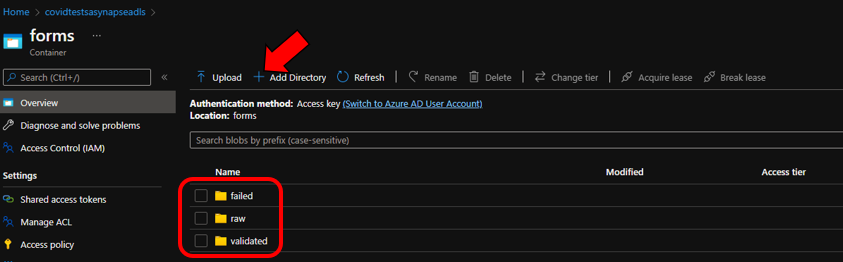

# Deployment Guide 
Please follow the steps below to set up the Azure environment

## Step 1: Download Files
Clone or download this repository and navigate to the project's root directory.

## Step 2: Security Access 
### Step 2.1: Add your IP address to Synapse firewall
Before you can upload assests to the Synapse Workspace you will need to add your IP address:
1. Go to the Synapse resouce you created in the previous step. 
2. Navigate to `Networking` under `Security` on the left hand side of the page.
3. At the top of the screen click `+ Add client IP`
      
4. Your IP address should now be visible in the IP list

### Step 2.2: Update storage account permisions 
In order to perform the necessary actions in Synapse workspace, you will need to grant more access.
1. Go to the Azure Data Lake Storage Account for your Synapse Workspace
2. Go to the `Access Control (IAM) > + Add > Add role assignment` 
3. Now search and select the `Storage Blob Data Contributor` role and click "Next" 
4. Click "+ Select members", search and select your username and click "Select" 
5. Click `Review and assign` at the bottom

[Learn more](https://docs.microsoft.com/azure/synapse-analytics/security/how-to-set-up-access-control)

## Step 3: Setting up Storage Account and Azure Data Lake Storage
The Azure Data Lake Storage (ADLS) is used to receive and store the images (COVID Test attestation forms and Vaccination Cards). The Logic Apps will send images stored in ADLS to the Computer Vision (Forms Recognizer) model to extract fields.

1. Go to the [Azure Portal](portal.azure.com) and select the Storage Account that was created as part of the Synapse deployment 
  
2. Select the "forms" container and add three directories - `failed`, `raw`, `validated`.

3. Select the training container and add one directory - `forms`
4. Select the results container and add two directories - `failed`, `validated`

## Step 4: Train Form Recognizer models
In this step you will train two custom Form Rrcognizer models for Covid Test forms and Vaccination Cards 
* Go to the [Form Recognizer Model Deployment Guide](./FormsRecognizerModel.md) to train the models.

## Step 5: Custom Vision
In this step you will train a custom vision model to check the CDC logo on the vaccination card. 
* Go to the [Custom Vision Model Deployment Guide](./CustomVisionModel.md) to train the model and publish an interation.

## Step 6: Upload Assets and Run SQL Scripts
1. Launch the Synapse workspace [Synapse Workspace](https://ms.web.azuresynapse.net/)
<!-- 2. Go to the `Develop` Hub, click the `+`, and click `Import` to select all notebooks from this repository's [folder](./Code/Notebooks)
3. For each of the notebooks, select `Attach to > spark1` in the top dropdown
4. Configure the parameters in the following notebooks and publish the changes -->
2. In the `Develop` Hub, click the `+`, and click `Import` to select all SQL scripts from this repository's [folder](./Code/SQLScripts)
3. For each SQL script, select `Connect to > sqlpool1` in the top dropdown
4. Select `Run` in the top to create the SQL tables 

## Step 7: Deploy Logic App
In this step you will deploy the reqired resources to process Test forms and/or Vaccination cards sent via email. 
* Go to the [Logic App Deployment Guide](./LogicAppConfiguration.md) to set up the logic apps.

## Step 8: Power BI Set Up 
1. Open the [Power BI report](https://github.com/microsoft/Azure-Solution-Accelerator-to-automate-COVID-19-Vaccination-Proof-and-Test-Verification-Forms/tree/main/Deployment/PowerBI/TestingVaccineDashboard.pbix) in this repository

2. Click the Transform data dropdown and click Data source settings 

3. Select the Azure Synapse Workspace connection, select `Change Source...` and provide your SQL Server Database name under Server and click `OK`
    * Navigate to the Synapse Workspace overview page in the Azure Portal, copy the Dedicated SQL endpoint
4. Select `Edit Permissions`, under Credentials select `Edit`, sign in to your Microsoft Account, click "OK" and click "Close"
5. Select `Refresh`

<!-- ## Step 9: Function App
The Function is used in the Covid Check Power App to select/insert/update forms documents in the Cosmos DB.
Go to the Azure Portal and note down the name of your Function App.

Follow the steps described in Quickstart: Create a function in Azure with Python using Visual Studio Code Once the local project is created:

Replace the code of the init.py file with the code in the file `Deployment/Function/init.py`
In the code update the url and the key variable. The url should be the URI of your Cosmos DB. The Key is the Primary Key of your Cosmos DB.
Replace the code of the requirements.txt file with the code in the file `Deployment/Function/requirements.txt`
Once all the files are updated, save and Publish the local project to Azure.

After the publication, go to the Function App - Functions, and click on the Function.
Click the button Get Function Url and copy and save the URL. You'll need it in the next step.

## Step 10: Deploy and configure the Covid Check Power App
1. Go to https://make.preview.powerapps.com/
2. In the right upper corner, make sure you select the correct environment where you want to deploy the Power App.
3. Click on `Apps - Import Canvas App`
4. Click upload and select the [Deployment/PowerApp/CCMPowerApp.zip](./Deployment/PowerApp/CovidFormsPowerApp) Zipfile.
5. Review the package content. You should see the details as the screenshot below

  

6. Under the `Review Package Content`, click on the little wrench next to the Application Name `Covid Check`, to change the name of the Application. Make sure the name is unique for the environemnt.
7. Click Import and wait until you see the message `All package resources were successfully imported.`
8. Click on `Flows`. You will notice that all the flows are disabled. 

9. You need to turn them on before you can use them. Hover over each of the flows, select the button `More Commands` and click `Turn on`.

10. For each flow, you need to change the HTTP component so that the URI points to your Azure Function App. Edit each flow, open the HTTP component and past the Azure Function Url before the first &.
Your URI should look similar like the screenshot below.

12. After the modification, click the "Test" button in the upper right corner to test the flow. If all went well, you should receive "Your flow ran successfully".
13. Once the flows are modified, you should be able to open the Power App. -->

