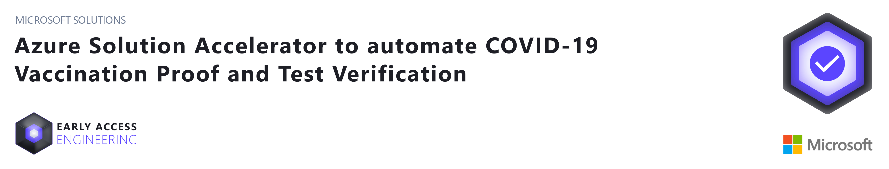
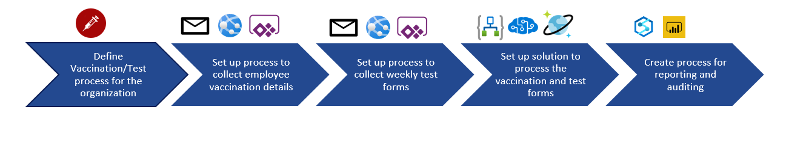
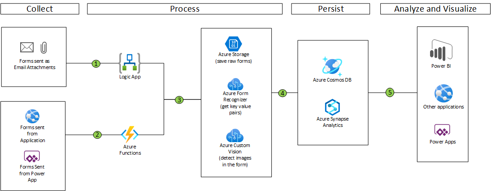
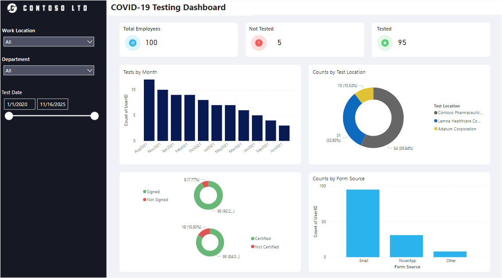

## About this Repository
As the world economy starts to open after Covid-19 restrictions, many employers have to follow regulatory requirements to ensure workplace safety through the vaccination and testing of employees before they can physically return to the workplace.
The two most common requirements are:
* Vaccination requirements
* Regular (e.g. weekly) testing

Vaccination requirements are generally met by presentating a valid vaccination record. For e.g., in the United States, this is in the form of the CDC Vaccination Card. Therefore, many employers request a vaccination card be sumbitted as proof of vaccination.

> 

Validating vaccination cards may be a one-time event for each employee (for now), whereas testing is an ongoing activity. Coupled with staffing shortages and the time sensitive nature for Covid-19 testing, this can be a big overhead, especially if there are many employees in the organization.

This solution helps accelerate the automation of collecting and processing of Covid-19 vaccination cards and test forms using Forms Recognizer. Azure Forms Recognizer is a cloud-based Azure Applied AI service that uses machine learning models to extract and analyze fields, text, and tables from documents. The solution also includes a simple test form to collect employee details, type of test and test center/location details etc. This form can be customized to include more details as needed.

## Prerequisites
To use this solution accelerator, you will need access to an [Azure subscription](https://azure.microsoft.com/en-us/free/). While not required, a prior understanding of Azure Form Recognizer, Azure Logic Apps, Azure Synapse Analytics and PowerBI will be helpful.

For additional training and support, please see:

1. [Azure Form Recognizer](https://docs.microsoft.com/en-us/azure/applied-ai-services/form-recognizer/?branch=release-build-cogserv-forms-recognizer)
2. [Azure Logic Apps](https://azure.microsoft.com/en-us/services/logic-apps/#overview)
3. [Azure Blob Storage](https://docs.microsoft.com/en-in/azure/storage/blobs/storage-blobs-introduction)
4. [Azure Cosmos DB](https://azure.microsoft.com/en-us/services/cosmos-db/)
4. [Azure Synapse Analytics](https://azure.microsoft.com/en-us/services/synapse-analytics/) 
5. [Power BI](https://docs.microsoft.com/en-us/power-bi/fundamentals/power-bi-overview)

## Getting Started
Start by deploying the required resources to Azure. The button below will deploy Azure Form Recognizer, Cosmos DB, Azure Synapse Analytics and its associated Azure Data Lake Storage Account Gen2, SQL Pool and Spark Pool:

> **NOTE**: Currently Custom Vision is not available in the following United States regions: `Central US`, `West Central US`, `West US`, `West US3`. Please select any other region when deploying this solution.

* Go to the [Deployment Guide](./Deployment/Deployment.md) to set up your Azure environment

> **NOTE**: Be sure to manually pause the SQL pool when you are not using it from the Synapse Workspace to reduce cost. Follow the steps below to pause the SQL pool:  
> * Navigate to the Synapse workspace
> *  Go to `Manage` > `SQL pools` > Pause the SQL pool 

## Architecture
The architecture diagram below details what you will be building for this Solution Accelerator.

## Power BI Dashboards

## DISCLAIMER
By accessing this code, you acknowledge that the code is not designed, intended, or made available: (1) as a medical device(s); (2) for the diagnosis of disease or other conditions, or in the cure, mitigation, treatment or prevention of a disease or other conditions; or (3) as a substitute for professional medical advice, diagnosis, treatment, or judgment. Do not use this code to replace, substitute, or provide professional medical advice, diagnosis, treatment, or judgement. You are solely responsible for ensuring the regulatory, legal, and/or contractual compliance of any use of the code, including obtaining any authorizations or consents, and any solution you choose to build that incorporates this code in whole or in part.

## License
MIT License

Copyright (c) Microsoft Corporation.

Permission is hereby granted, free of charge, to any person obtaining a copy
of this software and associated documentation files (the "Software"), to deal
in the Software without restriction, including without limitation the rights
to use, copy, modify, merge, publish, distribute, sublicense, and/or sell
copies of the Software, and to permit persons to whom the Software is
furnished to do so, subject to the following conditions:

The above copyright notice and this permission notice shall be included in all
copies or substantial portions of the Software.

THE SOFTWARE IS PROVIDED "AS IS", WITHOUT WARRANTY OF ANY KIND, EXPRESS OR
IMPLIED, INCLUDING BUT NOT LIMITED TO THE WARRANTIES OF MERCHANTABILITY,
FITNESS FOR A PARTICULAR PURPOSE AND NONINFRINGEMENT. IN NO EVENT SHALL THE
AUTHORS OR COPYRIGHT HOLDERS BE LIABLE FOR ANY CLAIM, DAMAGES OR OTHER
LIABILITY, WHETHER IN AN ACTION OF CONTRACT, TORT OR OTHERWISE, ARISING FROM,
OUT OF OR IN CONNECTION WITH THE SOFTWARE OR THE USE OR OTHER DEALINGS IN THE
SOFTWARE

## Note about Libraries with MPL-2.0 and LGPL-2.1 Licenses   
The following libraries are not **explicitly included** in this repository, but users who use this Solution Accelerator may need to install them locally and in Azure Synapse and Azure Machine Learning to fully utilize this Solution Accelerator. However, the actual binaries and files associated with the libraries **are not included** as part of this repository, but they are available for installation via the PyPI library using the pip installation tool.  
  
Libraries: chardet, certifi

## Contributing
This project welcomes contributions and suggestions.  Most contributions require you to agree to a Contributor License Agreement (CLA) declaring that you have the right to, and actually do, grant us the rights to use your contribution. For details, visit https://cla.opensource.microsoft.com.

When you submit a pull request, a CLA bot will automatically determine whether you need to provide a CLA and decorate the PR appropriately (e.g., status check, comment). Simply follow the instructions provided by the bot. You will only need to do this once across all repos using our CLA.

This project has adopted the [Microsoft Open Source Code of Conduct](https://opensource.microsoft.com/codeofconduct/). For more information see the [Code of Conduct FAQ](https://opensource.microsoft.com/codeofconduct/faq/) or contact [opencode@microsoft.com](mailto:opencode@microsoft.com) with any additional questions or comments.

## Trademarks
This project may contain trademarks or logos for projects, products, or services. Authorized use of Microsoft trademarks or logos is subject to and must follow [Microsoft's Trademark & Brand Guidelines](https://www.microsoft.com/en-us/legal/intellectualproperty/trademarks/usage/general). Use of Microsoft trademarks or logos in modified versions of this project must not cause confusion or imply Microsoft sponsorship. Any use of third-party trademarks or logos are subject to those third-party's policies.

## Data Collection
The software may collect information about you and your use of the software and send it to Microsoft. Microsoft may use this information to provide services and improve our products and services. You may turn off the telemetry as described in the repository. There are also some features in the software that may enable you and Microsoft to collect data from users of your applications. If you use these features, you must comply with applicable law, including providing appropriate notices to users of your applications together with a copy of Microsoft's privacy statement. Our privacy statement is located at https://go.microsoft.com/fwlink/?LinkID=824704. You can learn more about data collection and use in the help documentation and our privacy statement. Your use of the software operates as your consent to these practices.